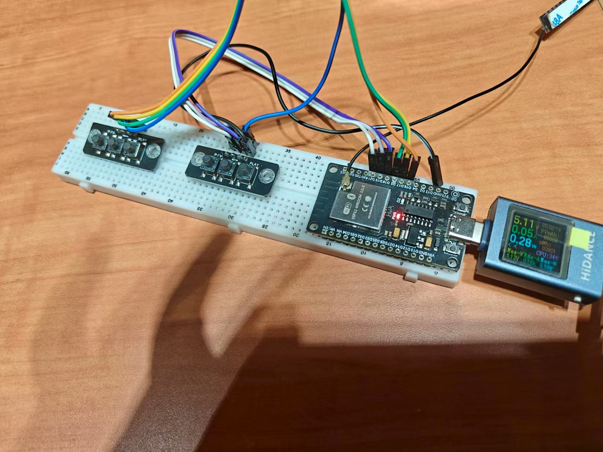

# 🎵 ESP32蓝牙音乐控制器 | ESP32 Bluetooth Music Controller

一个基于ESP32和 [ESP32-BLE-Keyboard](https://github.com/T-vK/ESP32-BLE-Keyboard/) 库的简易可定制蓝牙音乐控制器。  
A simple, customizable music controller using ESP32 and the [ESP32-BLE-Keyboard](https://github.com/T-vK/ESP32-BLE-Keyboard/) library.

---

## ✨ 特色功能 | Features

- 无线蓝牙音乐控制  
  Wireless Bluetooth music control
- 支持播放/暂停、上一曲、下一曲、音量加/减、静音  
  Supports Play/Pause, Next, Previous, Volume Up/Down, Mute
- 简单接线，易于搭建  
  Easy wiring and setup
- 硬件和代码均可自定义  
  Customizable hardware and code

---

## 📷 项目展示 | Project Demo

<div align="center">
  
</div>

---

## 🛠️ 硬件连接 | Hardware Setup

所有按键均使用 `INPUT_PULLUP` 输入模式。  
All buttons use the `INPUT_PULLUP` mode.

```cpp
// 定义引脚 | Define pins
const int PIN_NEXT = 18;            // 下一曲 | Next Track
const int PIN_PREV = 19;            // 上一曲 | Previous Track
const int PIN_PLAY_PAUSE = 21;      // 播放/暂停 | Play/Pause
const int PIN_MEDIA_VOLUME_UP = 16; // 音量加 | Volume Up
const int PIN_MEDIA_VOLUME_DOWN = 17; // 音量减 | Volume Down
const int PIN_MEDIA_MUTE = 5;       // 静音 | Mute
```

- 每个按键一端接对应的GPIO引脚，另一端接GND。  
  Connect one side of each button to the designated GPIO pin; the other side to GND.
- 不需要外部上拉电阻（已启用内部上拉）。  
  No external pull-up resistor needed.

---

## 🚀 快速上手 | Getting Started

1. 安装 Arduino IDE  
   Install Arduino IDE  
2. 添加 ESP32 开发板支持  
   Add ESP32 board support  
3. 安装 [ESP32-BLE-Keyboard](https://github.com/T-vK/ESP32-BLE-Keyboard/) 库  
   Install ESP32-BLE-Keyboard library  
4. 按照上述方式连接按键  
   Connect buttons as described above  
5. 上传代码，尽情享受！  
   Upload the code and enjoy!

---

## 💡 个性化 | Customization

- 可根据需要修改引脚分配或扩展功能。  
  Change pin assignments or add more functions in the code.

---

## 📜 许可协议 | License

MIT

---

欢迎 Star & Fork！  
Feel free to Star & Fork!
